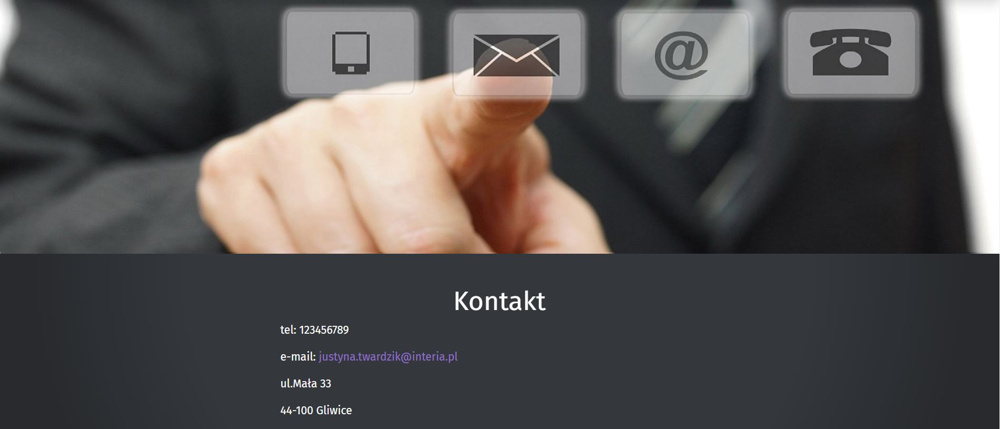

# Strona wizytówka
## Justyna Twardzik

## Cel projektu:
Celem projektu było stworzenie własnej strony typu wizytówka. Powstał on w ramach kursu organizowanego przez CodersCamp. Jest to pierwszy tego typu projekt a jego zadaniem było utrwalenie poznanego materiału dotyczącego HTML5 i CSS3. 

## Demo
Strona dostępna jest pod adresem: https://justyna782.github.io/Wizytowka/index.html

## Strona zawiera zakładki takie jak: 
* Strona główna - zawiera podstawowe informacje o autorze, 
* Umiejętności - spis posiadanych umiejętności, 
* Projekt - galeria zdjęć wraz z krótkim opisem projektu "Matematyka nie taka straszna", 
* Kontakt - dane kontaktowe.

## W trakcie tworzenia projektu wykorzystano:
* Box-model,
* Kaskadowość,
* Slektory CSS,
* Popularne tagi HTML,
* Podpinanie CSSa do HTMLa,
* Zapisywanie kolorów,
* Stylowanie tekstu,
* Zewnętrzne ikony/fonty,
* Flexbox,
* Position (absolute, relative),
* Aniacje keyframes,
* Bootsrap.

